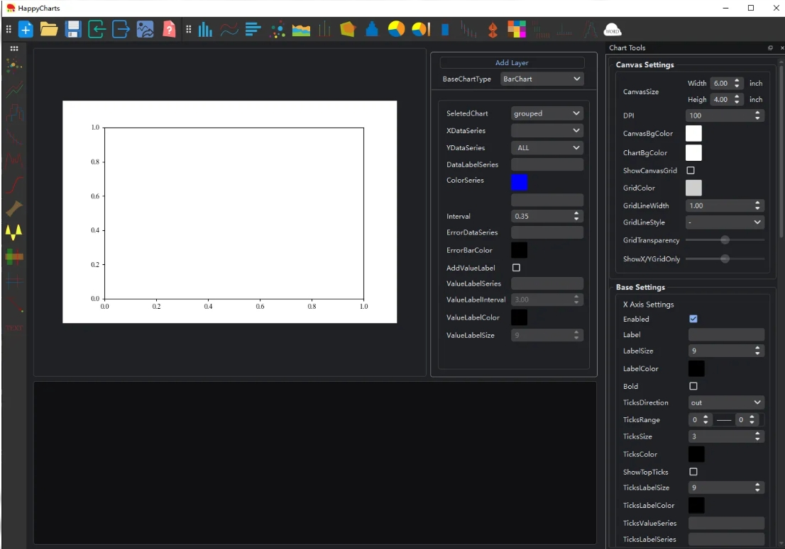
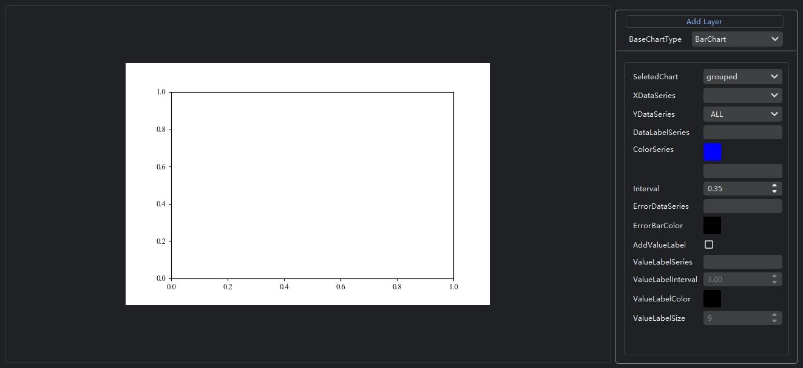
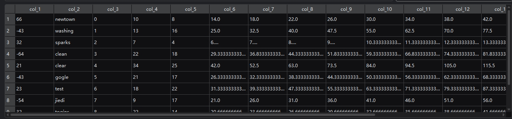
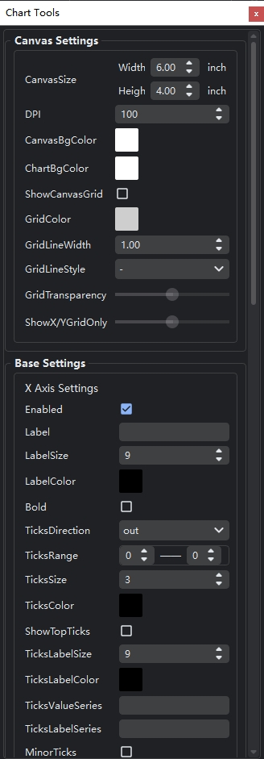
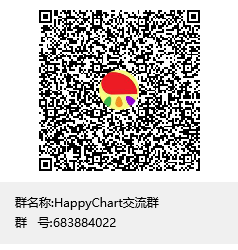

# HappyChart

## 介绍

HappyChart是一款专业的绘图软件，它可以以图层的方式将图表添加到绘图坐标上，借助于matplotlib库，HappyChart提供了一种非常灵活的绘图方式，可以对图表进行全方位的控制。相比于其他绘图软件，它的使用方式更加简单，界面更加简洁，您只需要调整相关参数，它会实时展示图形内容，让您所见即所得。

HappyChart界面主要分为4个部分：

**工具栏区域**：位于界面最上方，包含了基本数据输入输出工具以及图表图层模块。

基本工具栏包括：

新建：打开新的界面。

打开：打开已存在的HappyChart项目。

保存：保存HappyChart项目。

导入数据：导入绘图数据。

导出数据：导出绘图数据。

导出图片：导出绘制的图表，支持导出的图片格式包括png, jpg, jpeg, svg, tif, PDF。

帮助：打开帮助文档。

图层工具栏包括：

散点图层，折线图层，阶梯图层，误差棒图层，密度图层，CDF图层，回归拟合图层，填充区间图层，水平/竖直区间图层，水平/竖直线图层，文本图层和注释图层。

**绘图区域：**位于界面中部，包含图表显示区和选择图表区。图表显示区根据调整参数的变化可以实时显示变化；选择图表区可以选择想要绘制的图表以及对应图表的相关参数。

**数据区域：**位于界面的下部，用于展示所导入的数据，图表使用该数据进行绘制。

**图表参数工具栏区域：**位于界面右部，是调整整个图表画布、坐标轴、标题以及图例的核心模块。

## HappyChart操作文档
[HappyChart操作文档](https://www.littlely.top/happychart-manual)

## HappyChart工具栏参数设置

图表参数工具栏参数包含两类：画布设置(Canvas Settings)和基本设置(Base Settings)。

**画布设置参数：**

CanvasSize：画布大小设置，单位为英寸

DPI：图表图片的dpi

CanvasBgColor：画布背景颜色

ChartBgColor：图表背景颜色

ShowCanvasGrid：是否显示网格，默认否

GridColor：网格颜色

GridLineWidth：网格线条宽度

GridLineStyle：网格线条类型

GridTransparency：网格透明度

ShowX/YGridOnly：只显示X/Y网格，默认都显示，可以滑动滑块只显示X或Y轴网格

**基本设置：**

基本设置包含X轴设置，Y轴设置，标题设置，图例设置以及其他设置。

X轴设置(X Axis Settings)：

Enabled：是否启用坐标，默认为启用

Label：坐标标签

LabelSize：坐标标签大小

LabelColor：坐标标签颜色

Bold：坐标标签是否加粗

TicksDirection：坐标轴刻度朝向

TicksRange：坐标轴刻度范围，都为0时由图表自动确认坐标轴刻度范围，否则按照设置的坐标轴范   围进行展示

TicksSize：刻度大小(长度)

TicksColor：刻度颜色

ShowTopTicks：显示图表上部刻度

TicksLabelSize：刻度标签大小

TicksLabelColor：刻度标签颜色

TicksValueSeries：刻度值系列，当坐标显示的刻度标签不满足你的要求时，可以设置刻度值TicksValueSeries及其需要显示的刻度标签TicksLabelSeries来改变图表显示的刻度标签

TicksLabelSeries： 刻度标签系列，需要搭配TicksValueSeries使用

MinorTicks：是否显示副刻度

MinorTicksInterval：副刻度间隔

TicksLabelAngle：刻度标签角度

Y轴设置(Y Axis Settings)：

见X轴设置

标题设置(Title Settings)：

Title：标题

TitleSize：标题大小

TitleColor：标题颜色

Bold：标题字体是否加粗

TitlePosition：标题位置

图例设置(Legend Settings)：

Enable：是否启用图例，默认启用

LegendTitle：图例标题

LegendTitleSize：图例标题大小

LegendTextSize：图例内容文本大小

LegendPosition：图例位置

LegendColumns：图例列数

LabelColor：图例标签字体颜色

LegendFrame：是否显示图例外框，默认不显示

LegendFrameColor：图例外框颜色

LegendBgColor：图例背景颜色

FrameTransparency：外框透明度

其他设置(Other Settings)：

FrameStyle：图表外框样式

FrameColor：图表外框颜色

其他参数请详见HappyChart操作文档。

## HappyChart讨论交流群

QQ群：

联系邮箱：guangquxx@163.com